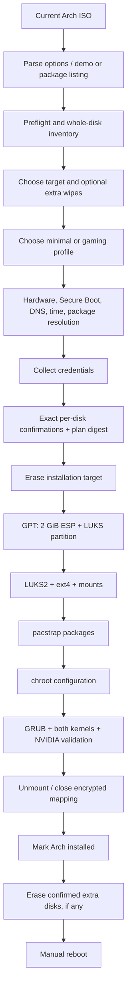

# SKITTLES Architecture

SKITTLES is a single audited Bash entry point that generates the installed-system configuration during a fresh Arch install. It intentionally does not maintain a long-lived daemon or remote control plane.

## Installation flow

The important ordering rule is that extra wipe-only disks are not touched until the target installation has completed and unmounted successfully.

## Preflight

Preflight requires a local interactive root console on a current Arch ISO, x86-64, UEFI variables, writable efivars, Secure Boot disabled, the i7-8700K, an RTX 3060 Ti PCI ID accepted by this release, CPU frequency policy availability, working DNS, synchronized time, and resolvable package sets.

The installer acquires a process lock so two SKITTLES instances cannot race drive state. `/mnt` must be unused and the `skittles-root` mapper name must not already exist.

## Destructive authorization model

Drive inventory is recorded as path + kernel major/minor identity + size + model/serial/WWN metadata. A candidate must be a supported whole internal SATA/NVMe disk and must not be read-only, removable, USB, mounted, active swap, or held by LUKS/LVM/RAID.

The user selects one target and zero or more extra wipe disks. Each selected disk requires an exact `ERASE /dev/...` string. After all confirmations, SKITTLES computes a SHA-256 digest over release version, wipe mode, profile, discard choice, selected indices, disk identities, and sizes. Every destructive helper checks that approved digest and only accepts a drive present in the confirmed plan.

Disk identity and busy state are checked again immediately before destructive work. There is no automatic fallback disk.

## Partition and encryption layout

The target receives GPT with:

1. a 2 GiB EFI System Partition, FAT32, label `EFI`, mounted at `/boot`;
2. the remaining space as a Linux LUKS partition.

The second partition is formatted as LUKS2 with Argon2id. The mapping `skittles-root` contains one ext4 filesystem labelled `archroot`. `/home` is a directory inside that encrypted filesystem, not a separate partition.

The ESP is intentionally outside LUKS so UEFI/GRUB can boot it. This means boot files are unencrypted and, because Secure Boot is not configured, unsigned.

## Package installation

The minimal profile installs explicit base, Plasma, networking/audio, NVIDIA, firewall, and zram packages. The gaming profile adds only its explicit Steam/32-bit graphics/GameMode/MangoHud/NTSync list. Package resolution is checked before disk writes using temporary pacman metadata. The selected pacman configuration is then used by `pacstrap`; gaming persists `[multilib]` for later upgrades.

## Chroot configuration

The generated chroot script configures locale/time/hostname, account passwords, sudo, private home permissions, Baloo, SDDM, firewall, NetworkManager/resolved privacy defaults, journald, optional GameMode, zram, kernel hardening, coredumps, mkinitcpio, both NVIDIA kernel module sets, GRUB, enabled services, `/etc/skittles-release`, and `skittles-doctor`.

Passwords are delivered to the chroot over stdin as NUL-separated values rather than command arguments, then variables are unset. The temporary chroot helper is removed before completion. The live ISO resolver remains available during chroot configuration; only after `arch-chroot` exits successfully and releases its resolver bind mount does the outer installer establish the target systemd-resolved symlink.

## Boot configuration

SKITTLES uses GRUB in UEFI mode, creates both the normal `SKITTLES` EFI entry and a removable fallback `EFI/BOOT/BOOTX64.EFI`, and generates entries for `linux` and `linux-lts`. The shared kernel command line unlocks the LUKS UUID through `sd-encrypt`, selects the ext4 root UUID, and sets `zswap.enabled=0` so the zram swap device is not fronted by zswap on Arch kernels.

NVIDIA modules are late-loaded rather than embedded in initramfs. Current Arch `nvidia-open` / `nvidia-open-lts` packages supply modules for the two supported kernels. The installer verifies both module trees before finalizing initramfs and boot configuration.

## Networking/privacy layer

nftables is parsed before service enablement. Its configuration idempotently destroys and recreates only `table inet skittles`; it never flushes the global ruleset, so separately owned VPN, container, virtualization, and user tables survive a SKITTLES firewall reload. NetworkManager is ordered after nftables and `systemd-resolved`. NetworkManager owns connection management but sends network-provided DNS to resolved; `/etc/resolv.conf` points at the resolved stub and `FallbackDNS=` disables compiled-in public fallback resolvers.

Privacy defaults are documented in [PRIVACY.md](PRIVACY.md). They reduce broadcast/stable-hardware identity leakage but do not create anonymity or encrypted DNS.

## Gaming profile

The gaming profile enables multilib and adds Steam, 32-bit NVIDIA/Vulkan libraries, GameMode, MangoHud, and `ntsync-autoload`. GameMode may request the performance governor, best-effort I/O priority 0, and a session-scoped split-lock mitigation change only for participating games. No persistent performance governor, global split-lock change, GPU overclock, or global overlay injection is configured.

## Failure cleanup

On failure, SKITTLES clears credential variables, removes its temporary helper, and only attempts to unmount or close resources it records as its own. It does not force-unmount unrelated filesystems or globally disable swap. There is no rollback or resume after destructive work begins.

If installation fails before completion, extra wipe-only disks remain untouched. If an extra wipe fails after installation, Arch remains installed but a previously processed extra disk can already be erased and the failing disk can be partly erased.

## Doctor

`skittles-doctor` is installed at `/usr/local/bin/skittles-doctor`. It is local, read-only, does not upload data, does not repair configuration, and never invokes sudo itself. It reports boot/security, NVIDIA module state, CPU policy/clocksources, zram/zswap/swap, storage geometry/LUKS state, networking/privacy, firewall ownership, display/Vulkan/GameMode/NTSync, and failed-service state. Root-only checks are available when the user explicitly runs `sudo skittles-doctor`.
